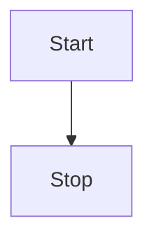

I wanted to be able to have mermaid diagrams in my blog posts.


The goal is to be able to render the following mermaid diagram in markdown:


````text

````

As an actual diagram below:


## Approaches

1. Static - render the diagram as an image when the blog post is built.
2. Dynamic - load mermaid.js and use it to render the diagram when the page is loaded.

Generally, I prefer static, but dynamic is simpler to immediately implement.

Static is challenging because:

- Mermaid is designed to be dynamic - to shift the diagram as the window size changes.
- Dynamic rendering requires a library to be added to the pipeline that handles rendering and specification of certain dimensions.

## Implementation

The goal is to be able to include the mermaid render script in the page.

This blog uses a minima theme - we need to be able to extend the theme pages to include the injection of mermaid.

The minima theme does not provide a convenient customization points that can be overridden, so we overwrite the theme directly.

1. Copy `_layouts/default.html` from the minima theme to our `docs`.
2. Edit `_layouts/default.html`. Right the existing `` add ``. The new sub-footer files is were we will add our extension.
    - note: we could have added this extension multiple places, I picked this one because it's the least complex file and won't interfere with other pieces too much.
3. Add `_includes/sub-footer.html`, and the following code:

    ```text
     
       
    
    ```

    - This ruby code only includes the additional code to render mermaid if `mermaid: true` is in its header.

4. Add `_includes/mermaid.html`

    ```html
    <script src="{{ "/static/mermaid.min.js" | relative_url }}"></script>
    <script>
        mermaid.initialize({
            startOnLoad:true,
            theme: "default",
        });
        window.mermaid.init(undefined, document.querySelectorAll('.language-mermaid'));
    </script>
    ```

    - This file loads the mermaid.js from the static folder. It's best practice to keep your website fully self contained and only load files from your own site. It's less secure and less reliable to load JavaScript from locations that are not controlled by you. If these external CDNs experience issues they impact your site. Additionally, loading JavaScript from another site is injecting code you don't control into your site, and this code can change any time. Scary!

5. Add `static/mermaid.min.js` this is a copy from [Mermaids NPM distribution](https://www.npmjs.com/package/mermaid). To update this file simply copy over the new code from this distribution.
    - The main reason to update would be if there are new mermaid features.
    - Generally, we assume mermaid has backwards compatibility. But if not the case we could host multiple copies of different versions.
    - note: I added the specific mermaid version number to the file `mermaid-11.12.2.min.js` this makes it easier to check what is supported and handle new versions later by specifying the version in the post header.
