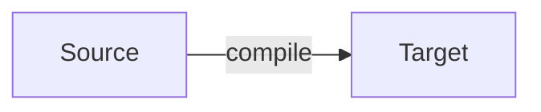
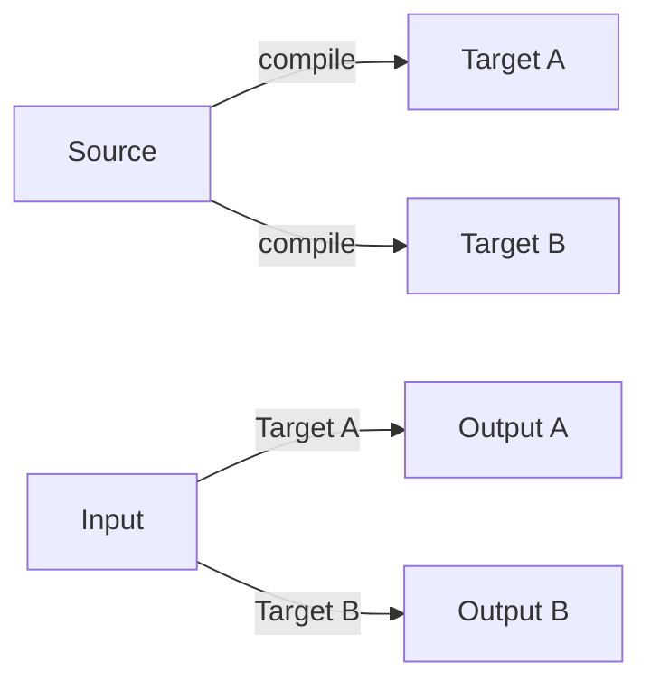
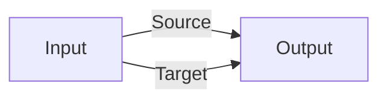

What does it mean for a program to be 'correct'?

First, we need to define correct.

Let's start with compilers.

A compiler translates a source language to a target language.



For example we might want to translate __c__ into ARM assembly:

__C__

```c
int a = 1;
int b = 2;
int c = a + b;
```

__ARM assembly__

```arm
mov x0, #3 // Load the value 3 into a register
```

How do we know our compiler did it's job correctly?

## By Definition

One option is _by definition_. We simply say that whatever the compiler does is correct. This probably isn't what most people are looking for.

A benefit of definition is what you see is what you get. The challenge is the definitions can be complex to understand.

A drawback of definition is what happens when there are different targets?

By definition doesn't tell you how different targets will behave for the same input.



## Equivalence

Generally for a compiler, what is useful is a definition of equivalence for the Source and Target.

I'd like to know for any sequence of input the output is the same for both source and target.





This definition of equivalence is often seen as the minium bar for compilers. It's difficult enough to prove, as source and target languages can be quite complex and have a lot of nuance.

Generally, this idea of behavioral equivalence is what is used for [Compiler Correctness](https://en.wikipedia.org/wiki/Compiler_correctness)

- [CompCert](https://en.wikipedia.org/wiki/CompCert)
- [CakeML](https://cakeml.org/)


## Key Point

To determine if something is 'correct' you need to specifically define what 'correct' means.
